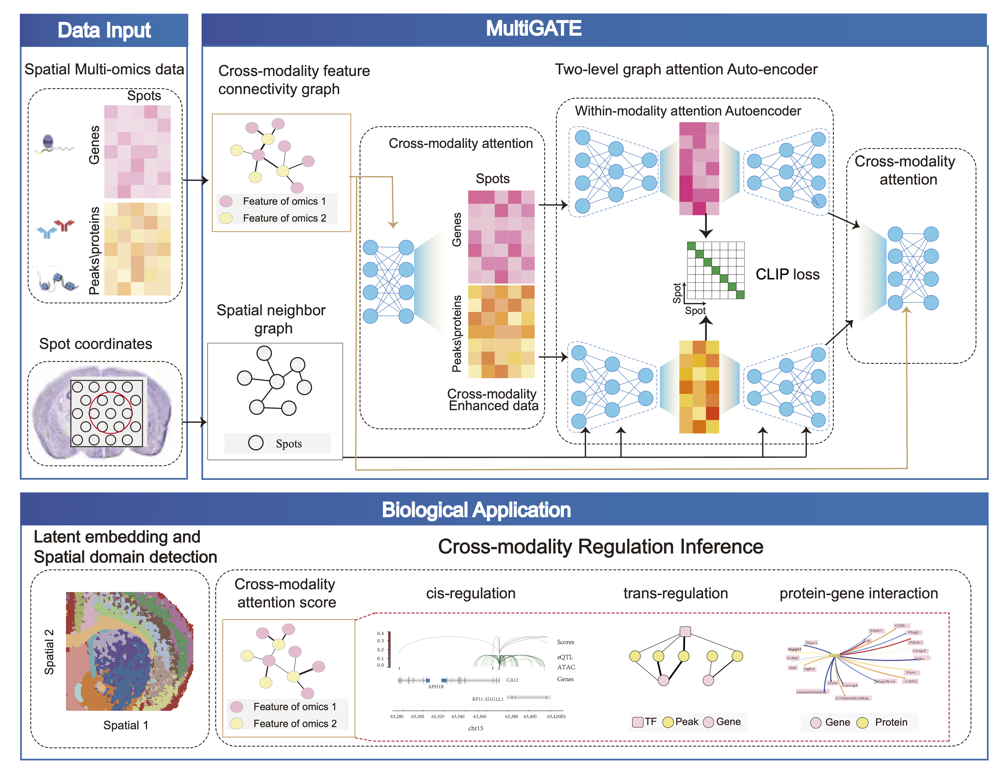

Welcome to MultiGATE's documentation!
===================================

**MultiGATE** is a novel method that utilzes a two-level graph attention auto-encoder
to integrate multi-modality and spatial information effectively.
The GitHub repository can be found at `GitHub <https://github.com/cuhklinlab/MultiGATE>`_.

.. note::

   This project is under active development.

User Guide
--------------------

.. toctree::
   :maxdepth: 2

   install

MultiGATE Tutorials
-----------------------

.. toctree::
   :maxdepth: 2
   
   notebooks/human
   notebooks/spleen
   notebooks/p22
   notebooks/analysisAttentiontestused0709

   